## 1. DevOps用サービスプリンシパルの準備

### 1-1 サービスプリンシパルの作成

1. [アプリの登録](https://docs.microsoft.com/ja-jp/power-bi/developer/embedded/embed-service-principal#step-1---create-an-azure-ad-app)を実施します。
2. 以下の情報をメモします。

- アプリケーション (クライアント) ID 
- ディレクトリ (テナント) ID
- クライアント シークレットの値

### 1-2 権限付与

1. [Azure portal を使用して Azure ロールを割り当てる](https://docs.microsoft.com/ja-jp/azure/role-based-access-control/role-assignments-portal?tabs=current)を参考に、作成したサービスプリンシパルを対象のリソースグループの **所有者** に設定します。

## 2. DevOps環境の作成

### 2-1. サインアップ

[Azure DevOpsにサインインする](https://docs.microsoft.com/ja-jp/azure/devops/user-guide/sign-up-invite-teammates?view=azure-devops)に従って、プロジェクトを作成します。

### 2-2. Repositryのインポート

1. **Repos**->**Files**->**Import**の順にクリックします

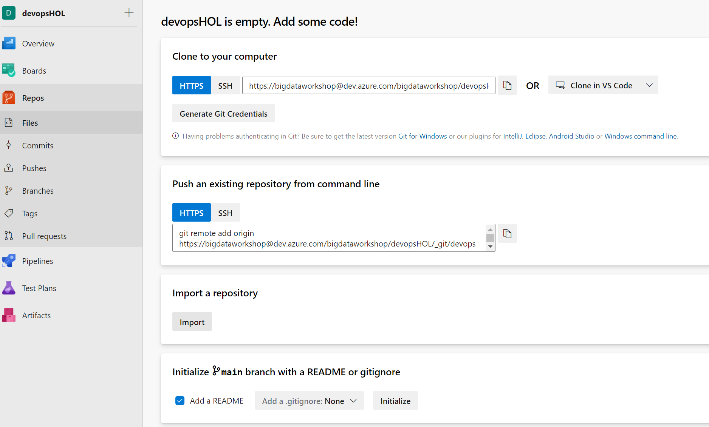

2. **https://github.com/ryoma-nagata/HOL-IaC-AzureDevOps.git**を入力して、**Import**をクリックします。

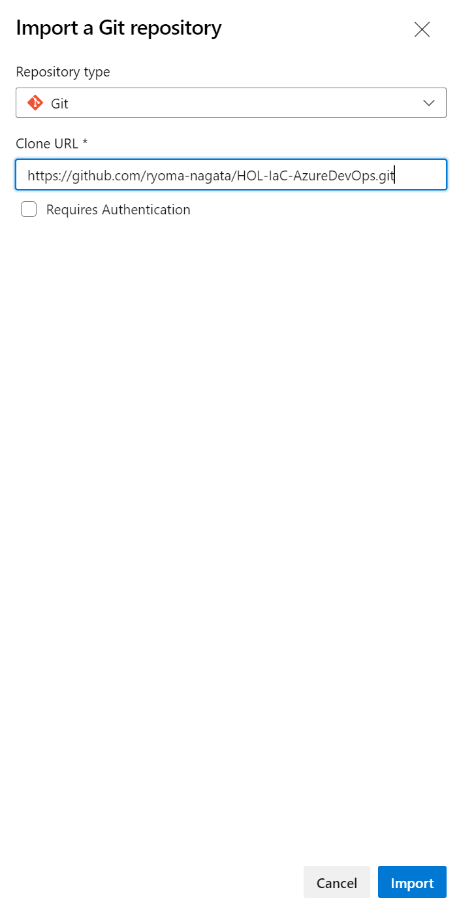

3. リポジトリがインポートされていることを確認します。

### 2-3. ブランチの作成

### 2-4. サービス接続の作成

1. **Project setting**に移動します。

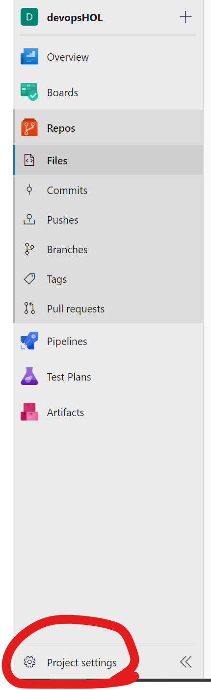

2. **Service connections**->**Create service connection**の順にクリックします。

[参考](https://docs.microsoft.com/ja-jp/azure/devops/pipelines/library/service-endpoints?view=azure-devops&tabs=yaml#create-a-service-connection)

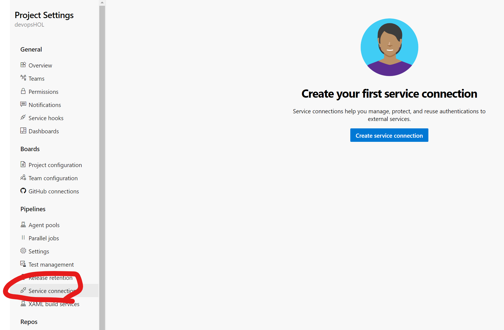

3. **Azure Resource Manager**を選択します。

4. **Service principal(manual)**を選択します。

5. 各項目を入力のうえ、**name**には**azure-devops-service-connection**と入力します。

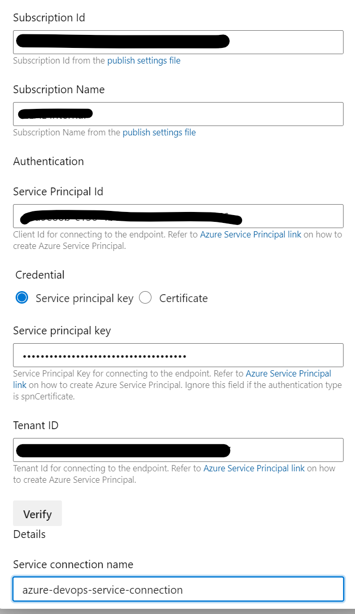

6. **Grant access permission to all pipelines**にチェックをつけて**Verify and save**をクリックします。

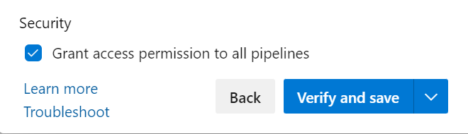

### 2-5. 環境の作成

#### (option) デプロイ承認ゲートの追加

## 3. DevOpsパイプラインの実行

### 3-1. 単体テストパイプラインの読み込みと実行

1. [.ado/workflows/arm-template-rg-ci-cd-dev.yml.yml](.ado/workflows/arm-template-rg-ci-cd-dev.yml.yml)を開き、**edit**にて以下の変数を設定します。

- AZURE_SUBSCRIPTION_ID
- RESOURCE_GROUP_NAME

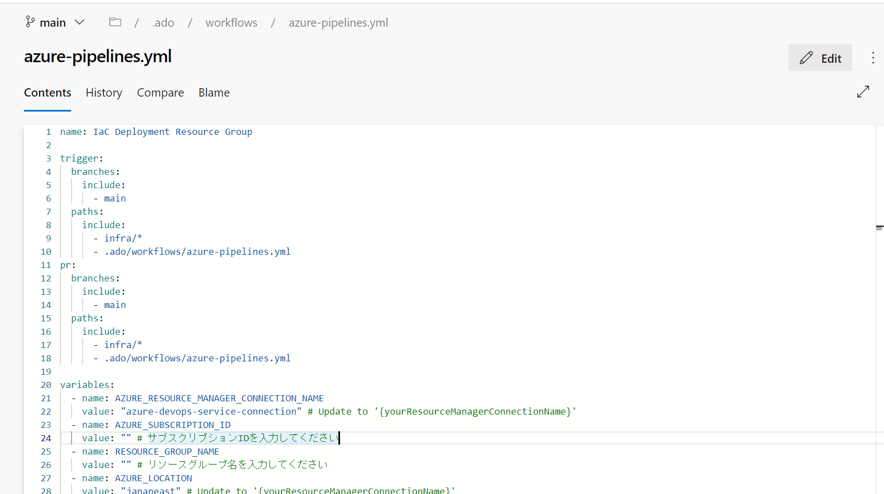

2. 編集後、**commit**します

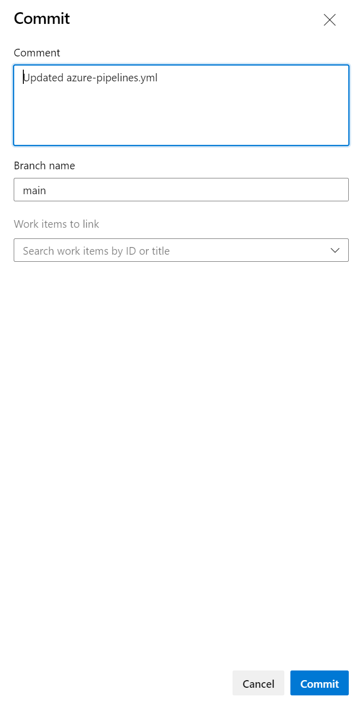

### 3-2. 開発環境デプロイパイラインの読み込みと実行

1. **Pipelines**->**Pipelines**->**Create Pipeline**の順にクリックします

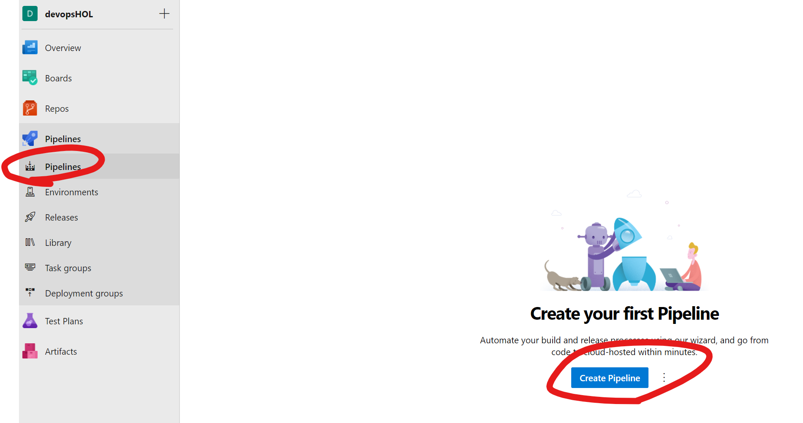

2. **Azure Repos git**を選択します。

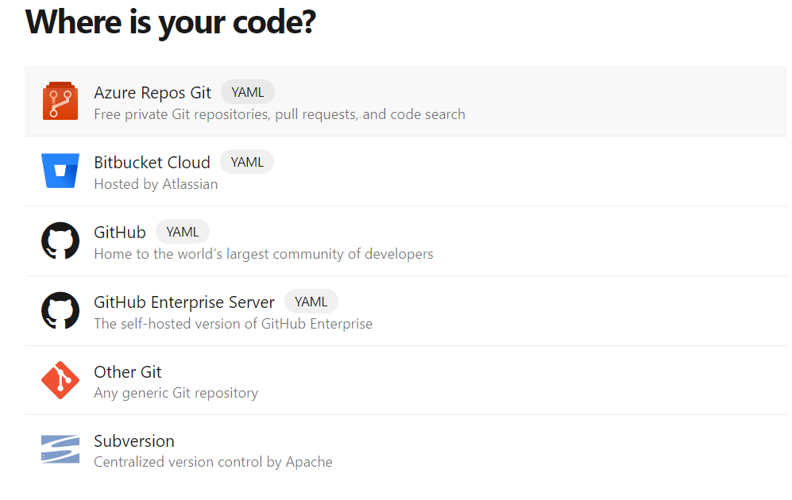

3. 対象のリポジトリを選択後、**Existing Azure Pipeline YAML file**を選択します。

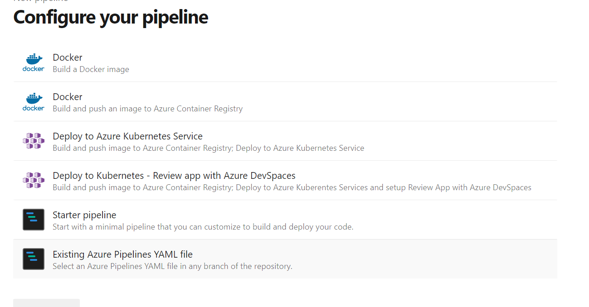

4. **/.ado/workflows/azure-pipelines.yml**を選択します。

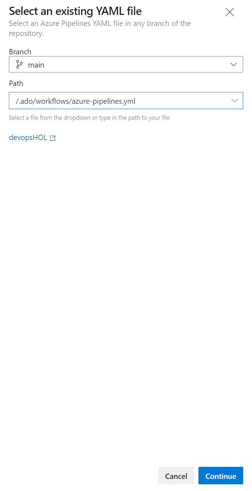

5. **Run**をクリックします

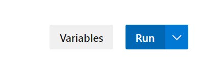

6. 対象のリソースグループの**デプロイ**画面から実行を確認可能です。

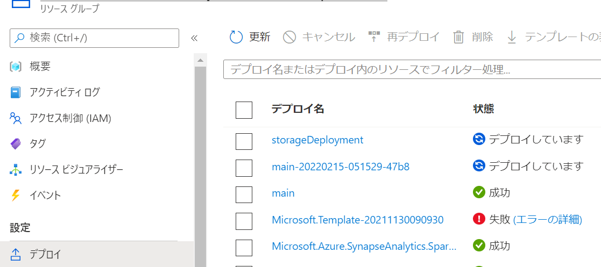

### 3-3. 本番環境デプロイパイラインの読み込みと実行

## 4. ブランチの保護

### 4-1. developブランチにマージする前に単体テストを行う

### 4-2. mainブランチへのマージにはレビュアーの承認が必要

## 5. 開発環境について

### 5-1. 要件

### 5-2. bicep環境のインストール

#### 直接インストール

#### devcontainer の利用

VSCode Remote Container環境を使用します。
  - [Ranchar Desktopのインストール](https://qiita.com/moritalous/items/14d4099023981dcf4fd2#ranchar-desktop%E3%81%AE%E3%82%A4%E3%83%B3%E3%82%B9%E3%83%88%E3%83%BC%E3%83%AB)を参考にインストールして、[VS Code リモート コンテナー](https://docs.rancherdesktop.io/how-to-guides/vs-code-remote-containers/) を利用します。
  参考） [WSL 開発環境を設定するためのベスト プラクティス](https://docs.microsoft.com/ja-jp/windows/wsl/setup/environment) 

### 5-3. サンドボックスのデプロイ

