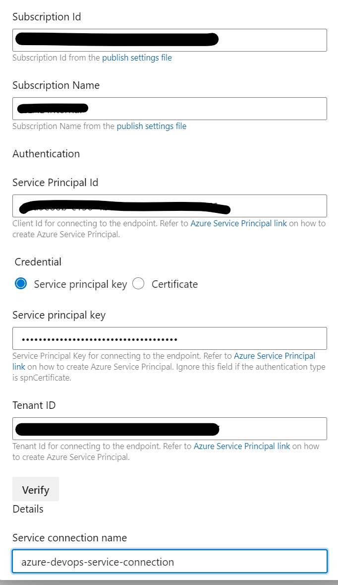
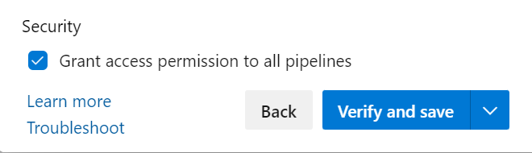
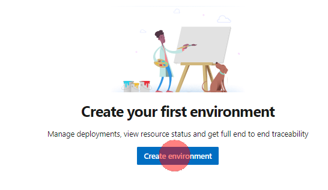
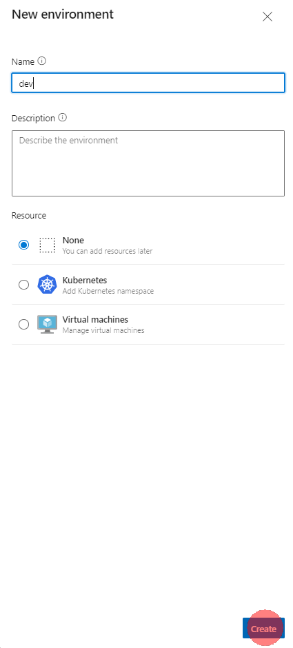

# DevOps環境の作成

## 1. サインアップ

[Azure DevOpsにサインインする](https://docs.microsoft.com/ja-jp/azure/devops/user-guide/sign-up-invite-teammates?view=azure-devops)に従って、プロジェクトを作成します。

## 2. Repositryのインポート

1. **Repos** -> **Files** -> **Import repository** の順にクリックします

2. **https://github.com/ryoma-nagata/IaCforAzure.git** を入力して、適宜名称を変更して **Import** をクリックします。

1. リポジトリがインポートされていることを確認します。

## 3. ブランチの作成

1. **New branch** をクリックします。

2. **developブランチ** を作成します。

3. **自身の作業用ブランチ** を作成します。

## 4. サービス接続の作成

1. **Project setting** に移動します。

2. **Service connections**->**Create service connection** の順にクリックします。

[参考](https://docs.microsoft.com/ja-jp/azure/devops/pipelines/library/service-endpoints?view=azure-devops&tabs=yaml#create-a-service-connection)

3. **Azure Resource Manager** を選択します。

4. **Service principal(manual)** を選択します。

5. 各項目を入力のうえ、 **name** には **azure-devops-service-connection** と入力します。

6. **Grant access permission to all pipelines** にチェックをつけて **Verify and save** をクリックします。

## 5. 環境の作成

1. **Environment** に移動します。

2. **Create environment** をクリックします。

3. **dev環境** を作成します。

4. **New environment** をクリックします。

5. **prod環境** を作成します。

###  (option) デプロイ承認ゲートの追加

1. **・・・** -> **Approvals and checks** をクリックします。

2. **Approvals** をクリックします。

3. 承認者を追加します。

## 次のステップ

[パイプラインの構成と初回実行](run-pipeline.md)