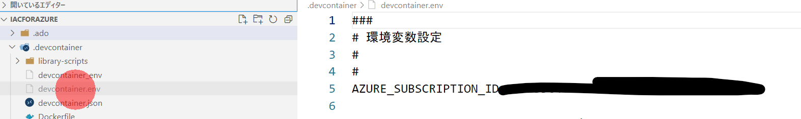
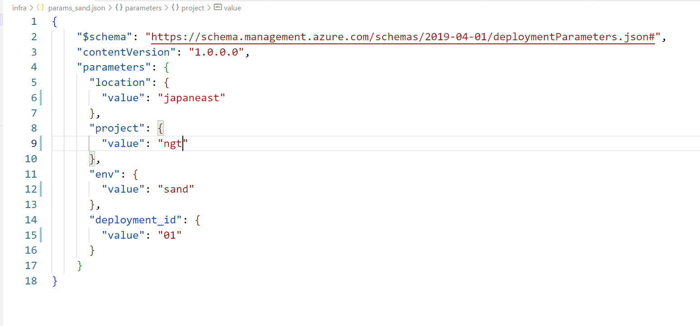

# ローカルでの開発について

## 1. bicep環境のインストール

### 直接インストール

[Bicep ツールのインストール](https://docs.microsoft.com/ja-jp/azure/azure-resource-manager/bicep/install) を参照して下さい。

### devcontainer の利用

[Ranchar Desktopのインストール](https://qiita.com/moritalous/items/14d4099023981dcf4fd2#ranchar-desktop%E3%81%AE%E3%82%A4%E3%83%B3%E3%82%B9%E3%83%88%E3%83%BC%E3%83%AB)を参考にインストールして、[VS Code リモート コンテナー](https://docs.rancherdesktop.io/how-to-guides/vs-code-remote-containers/) を利用します。

（参考） [WSL 開発環境を設定するためのベスト プラクティス](https://docs.microsoft.com/ja-jp/windows/wsl/setup/environment) 

## (option) devcontainerからサンドボックスのデプロイ

1. Remote containerを開く前に、devcontainer.envファイルを作成し、環境変数を設定します。このファイルはgitには反映されません。変更したらremote container を実行します。

2. **infra\params_sand.json** を編集します。

3.  **code\manualDeploy.azcli**　のコードを実行することで、手元でのテスト実行が可能です。

