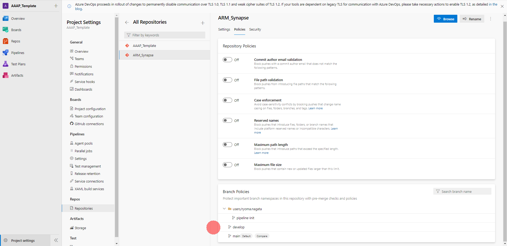
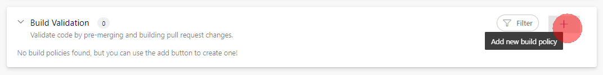
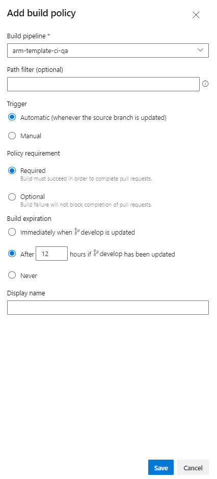
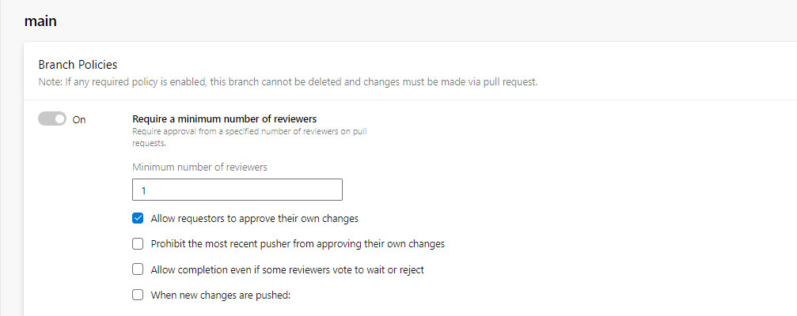

# ブランチの保護

## 1. developブランチにマージする前に単体テストを行う

1. **Project settings**-> **Repositories** -> **対象リポジトリ** -> **Polisies** -> **develop**　の順にクリックします。

2. **Build Validation** 内の、**＋** をクリックします。

3. **arm-template-ci-qa** を選択して、**Save** します。

## 2. mainブランチへのマージにはレビュアーの承認が必要

1. **main** を選択して、**Require minimum number of reviewers** をオンにしてレビュアー承認を要求するように構成します。

## 次のステップ

[Pull Requestでコードをマージする](try-pull-request.md)