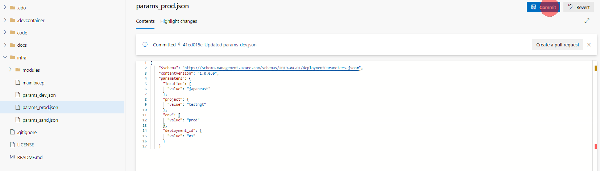
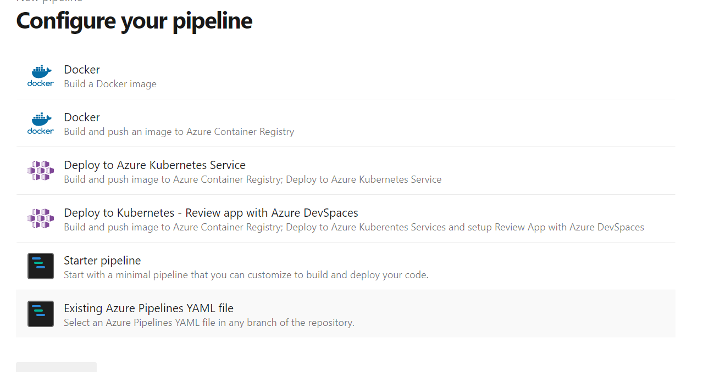
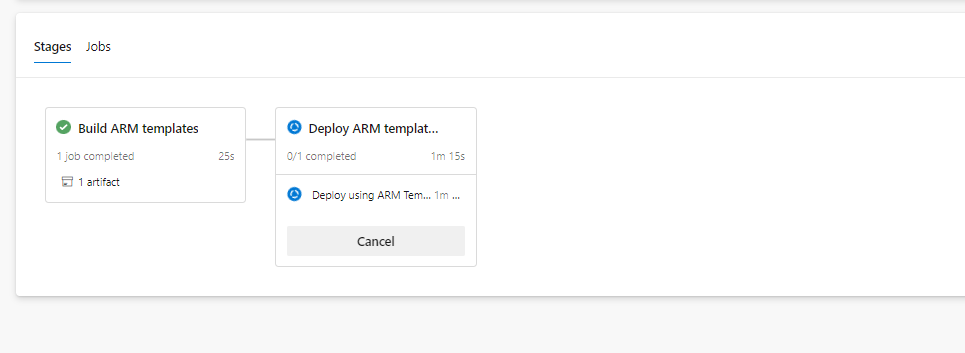
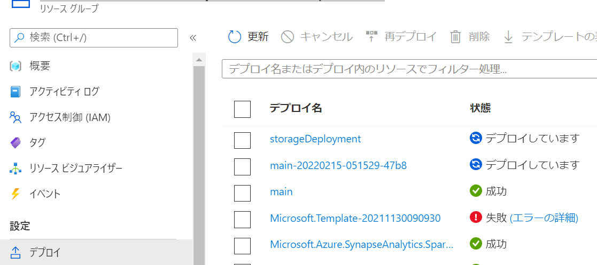

## 3. DevOpsパイプラインの実行

### 3-1 環境用パラメータファイルの設定

1. **Repos**->**Files**->**作業用ブランチ** をクリックしてブランチを切り替えます。

2. を開き、**Edit**をクリックします。

3. **project.value** の値を設定し、**Commit**します。

4. 同様に、**infra/params_prod.json**の**project.value** の値を設定し、**Commit**します

5. 最後に、**infra/params_sand.json**の**project.value** の値を設定し、**Commit**します

### 3-2. 単体テストパイプラインの読み込みと実行

1. **Pipelines**->**Pipelines**->**Create Pipeline**の順にクリックします

2. **Azure Repos git**を選択します。

3. 対象のリポジトリを選択後、**Existing Azure Pipeline YAML file**を選択します。

4. ブランチを**先ほど作業を行ったブランチ**に変更し、**/.ado/workflows/arm-template-rg-ci-qa.yml**　を選択します。

5. **AZURE_SUBSCRIPTION_ID** と **RESOURCE_GROUP_NAME**を設定し、**Save and run**をからパイプラインを実行します。

6. 検証が行われ、what-ifの結果などが確認できます。

7. パイプライン一覧からRenameを選択します

8. **arm-template-ci-qa** に名称変更します。

### 3-2. 開発環境デプロイパイラインの読み込みと実行

1. 同様の手順で、**/.ado/workflows/arm-template-ci-dev.yml** を選択します。

2. **AZURE_SUBSCRIPTION_ID** と **RESOURCE_GROUP_NAME**を設定し、**Save and run**をからパイプラインを実行します。

3. ARMテンプレートの生成と、dev環境への反映が実行されます。

4. 実行後は生成されたARMテンプレートを **1 published**からダウンロード可能です。

5. 対象のリソースグループの**デプロイ**画面から実行を確認可能です。

6. パイプライン名称を　**arm-template-ci-dev** に変更します。

**注意**

このパイプラインは本番環境デプロイパイプラインから参照されるため、確実に名称変更してください。

### 3-3. 本番環境デプロイパイラインの読み込みと実行

1. 同様の手順で、**/.ado/workflows/arm-template-ci-dev.yml** を選択します。

2. **AZURE_SUBSCRIPTION_ID** と **RESOURCE_GROUP_NAME**を設定し、**Save and run**をからパイプラインを実行します。

3. パイプラインの実行内容画面から**Review**をクリックします。

4. **Approve** をクリックします。prodに承認設定を行った場合は、このように承認ゲートが適用されます。

