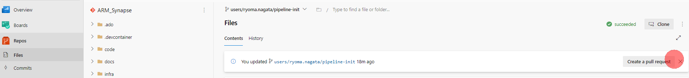
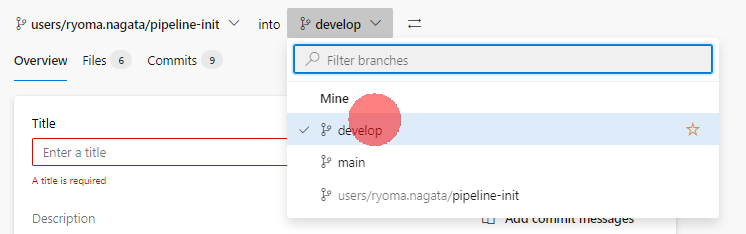
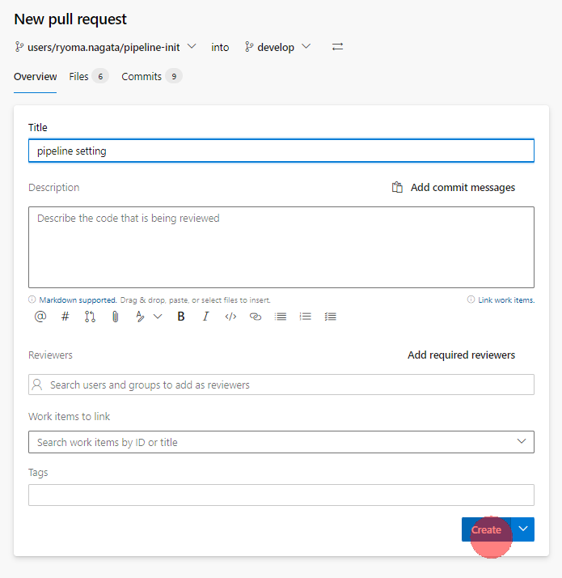
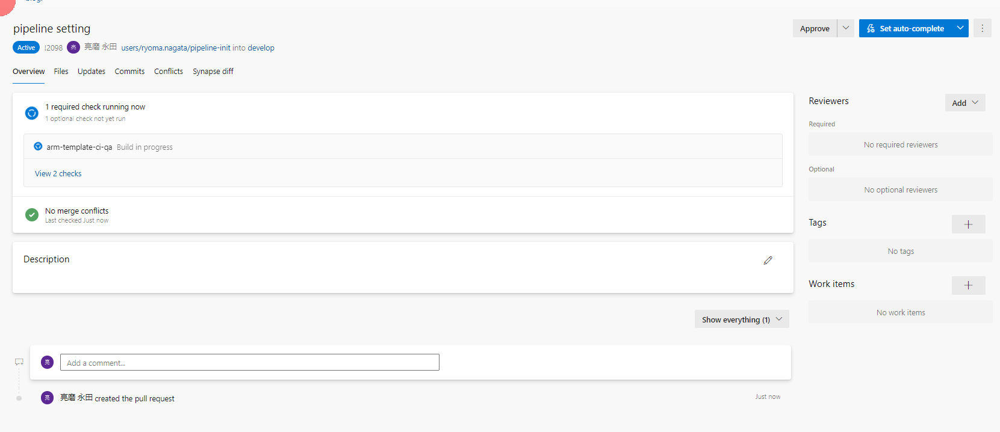
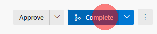
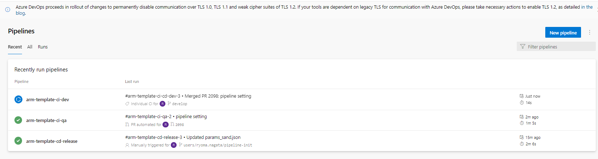
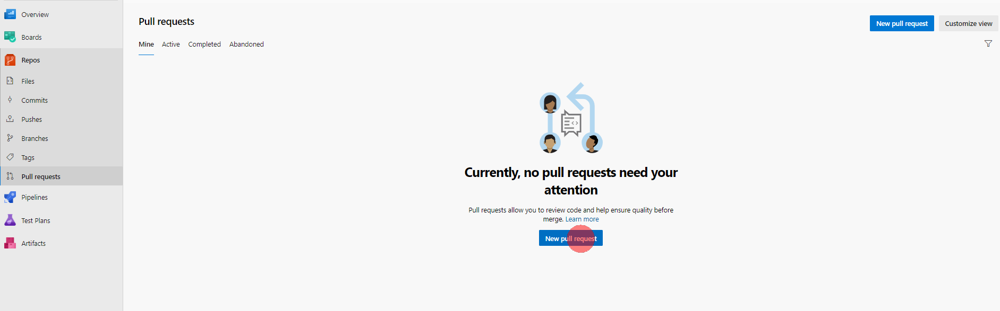
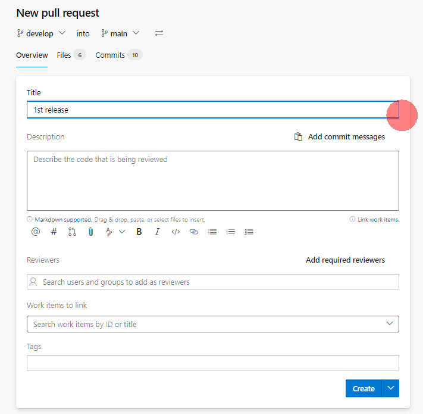
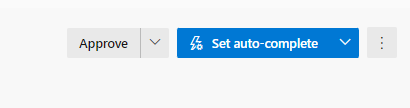
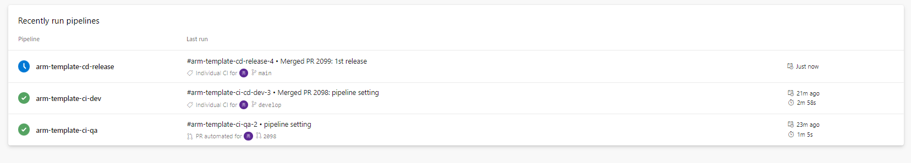

# Pull Requestでコードをマージする

## 1. devlopブランチへのコード統合とビルド（ARMテンプレート生成）

1. **Repos** -> **Files** -> **Create a pull request**　の順にクリックします。

2. マージ先をdevelopにします。

3. 適当なタイトルをつけて **Create ** をクリックします。

4. ブランチの保護で設定した検証パイプラインが実行されます。

5. **Complete** をクリックして、マージを完了します。

6. develop ブランチへのマージを検知して、開発環境へのデプロイパイプラインが起動します。
   
   

## 2. mainブランチへの反映とリリース

1. **Repos** -> **Pull requests** -> **New pull request** の順にクリックします。

2. **develop** -> **main** でPRを作成します。

3. ブランチの保護設定で承認が必要になっているので、　**Approval** をクリックします。

4. マージが完了すると、本番環境デプロイパイプラインが実行されます。

## 次のステップ

[ローカル環境での開発について](local-development.md)
